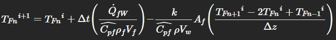
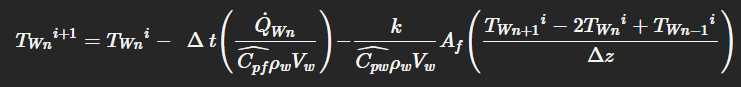

### Descripción general breve del proyecto y su relevancia sustentable.
Este proyecto se centra en la elaboración de un modelo matemático que genere un perfil de temperaturas para un fluido dentro de una bomba de calor.

La implementación de este modelo se basa en la necesidad que hay en el sur de Chile de poder calentar agua y otras cosas sin recurrir a métodos contaminantes como
el uso de leña o el uso de gas. Específicamente, el modelo se basa en el calentamiento de agua utilizando energía gracias a una bomba de calor. 

Se utiliza una bomba de calor porque además de permitir reducir la huella de carbono de la zona sur al no utilizar leña o gas, es una forma mucho más accesible para 
las comunidades locales, puesto que la instalación directa de bombas de calor en las casas permite tener una fuente de calor con una eficiencia energética superior
y más accesible.

La ciudad de Valdivia se tomó como referencia a la hora de implementar el modelo, es por esto que datos como la temperatura ambiente corresponden a la de esta ciudad.

### Explicación del sistema físico modelado, con diagrama o esquema descriptivo.
 

Con el modelo matemático implementado, se plantea un modelo de transferencia de calor unidimensional en estado transiente. Para esto, se utilizaron
coordenadas cilíndricas y se utilizó "z" como la variable espacial, la cual corresponde a la altura del tanque.

En la figura se puede ver el modelo de tanque con el que se trabaja, el cual posee un serpentín que va suministrando calor a las paredes del tanque, con
el objetivo de calentar el fluido que se encuentra dentro.
### Descripción del método numérico utilizado en profundidad.
El método que se utiliza para la resolución del modelo matemático implementado es el método FTCS (Forward Time - Centered Space).

Este método consiste en la implementación de discretizaciones del espacio y tiempo para resolver ecuaciones diferenciales parciales. En este caso, para el tiempo
se utiliza una diferencia hacia adelante, mientras que en el espacio se utiliza una diferencia central.

En nuestro modelo, se tiene la siguiente ecuación no discretizada:

 

Esta ecuación modela el comportamiento de la temperatura en estado transiente dentro de nuestro modelo de bomba de calor.

Para aplicar el método FTCS, se discretiza esta ecuación de acuerdo a lo dicho anteriormente: El tiempo se discretiza hacia adelante, mientras que
el espacio se discretiza centralmente.

De esta manera, se obtiene la siguiente ecuación discretizada:

 

Luego, para que el modelo se implemente de manera correcta, tambien se tiene que tener en consideración la pared del tanque durante todo el proceso, pues esta
pared posee intercambios de calor con el serpentín y con el ambiente. De esta manera se llega a la siguiente ecuación la cual representa el perfil de temperatura
de las paredes de la bomba:

 

Este método es ideal para la resolución de nuestro modelo porque el método FTCS es muy bueno en la resolución de ecuaciones de temperatura, pues fue para
este tipo de ecuaciones que el método fue creado. Nuestro modelo posee términos de conducción y convección, además de ser un modelo en estado transiente y unidireccional
con la variable espacial siendo "z".

### Instrucciones para ejecutar el código (dependencias, librerías, orden de ejecución).
.......

### Indicar gráficos o tablas que resuman los perfiles obtenidos y sus implicancias físicas.
.......