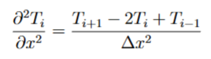
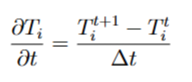
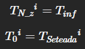
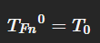
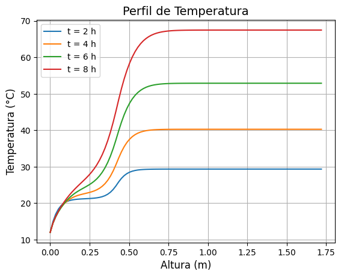
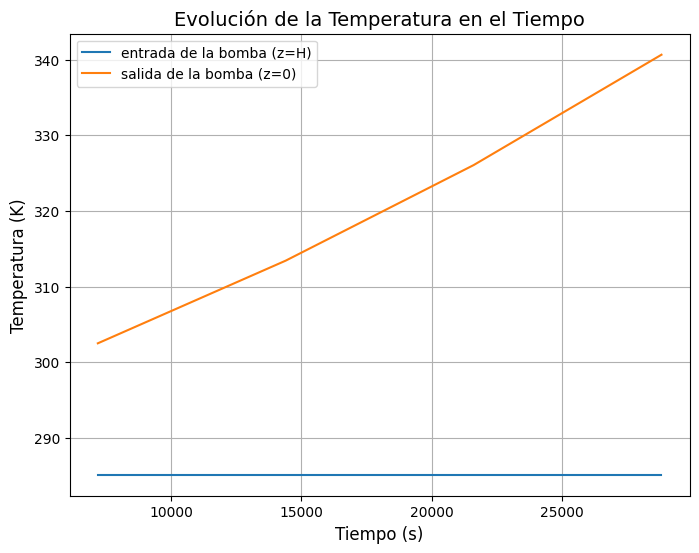

### Descripción general breve del proyecto y su relevancia sustentable.

Este proyecto se centra en la elaboración de un modelo matemático capaz de generar el perfil de temperaturas para un fluido dentro de una bomba de calor. El objetivo de esto es evaluar su potencial como posible alternativa sustentable para el calentamiento de agua en el sur de Chile.

En esta zona del país, donde las bajas temperaturas generan una alta demanda de calefacción, gran parte de la población depende todavía de la leña y el gas, los cuales son altamente contaminantes. Frente a esto, las bombas de calor representan una opción eficiente y de bajas emisiones, ya que permiten aprovechar energía térmica del ambiente sin recurrir a combustibles fósiles.

Por otro lado, su instalación tambien posee ventajas sociales, pues la instalación directa de bombas de calor en las casas permite tener una fuente de calor con una eficiencia energética superior y más accesible, al no depender del transporte de combustible proveniente de otros lugares.

Para este modelo se utilizó la ciudad de Valdivia como referencia, por lo que parámetros como la temperatura ambiental corresponden a los de esta ciudad.

### Explicación del sistema físico modelado, con diagrama o esquema descriptivo.
 

Con el modelo matemático implementado, se plantea un modelo de transferencia de calor unidimensional en estado transiente. Para esto, se utilizaron
coordenadas cilíndricas y se utilizó "z" como la variable espacial, la cual corresponde a la altura del tanque.

En la figura se puede ver el modelo de tanque con el que se trabaja, el cual posee un serpentín que va suministrando calor a las paredes del tanque, con
el objetivo de calentar el fluido que se encuentra dentro.

Como supuestos que se aplicaron para llegar a la ecuación gobernante se tiene que:
- Estado transiente del sistema.
- Entrada de la bomba en z = 0.
- Salida de la bomba en z = H.
- La temperatura se transfiere de manera unidireccional (solamente en la dirección z).
- El flujo de calor de la bomba de calor se modela como un flujo de calor uniforme en la superficie de la pared del tanque en la ubicación de la bobina del condensador.

De esta forma se lllegó a la siguiente ecuación que gobierna la transferencia de calor en nuestro modelo de bomba:

 

### Descripción del método numérico utilizado en profundidad.
Dado que no es posible resolver a mano la ecuación gobernante de este sistema, es necesario utilizar una herramienta computacional que permita la resolución numérica de esta ecuación. El método que se utilizará para la resolución de este modelo matemático es el método FTCS (Forward Time - Centered Space).

Este método utiliza un esquema explícito que consiste en la implementación de discretizaciones del espacio y tiempo para resolver ecuaciones diferenciales parciales. En este caso, para el tiempose utiliza una discretización hacia adelante, mientras que en el espacio se utiliza una discretización central. 

FTCS es ideal para resolver ecuaciones de difusión y convección en medios donde la temperatura evoluciona en función del tiempo y donde se tiene una única coordenada espacial, como es nuestro problema, donde se tiene un sistema 1D transiente que busca modelar un perfil de temperatura a lo largo del tiempo en una bomba de calor cilíndrica. En este caso, la única coordenada espacial que afecta es el eje "z", es decir, la altura.

En nuestro modelo, se tiene la siguiente ecuación no discretizada:

 

Esta ecuación modela el comportamiento de la temperatura en estado transiente dentro de nuestro modelo de bomba de calor.

Para el término convectivo de la ecuación obtenida, el cual pertenece al término que posee la coordenada espacial, se utiliza una diferencia finita central:

 

Luego, para el término temporal de la ecuación, se utiliza una diferencia finita hacia adelante en el tiempo:

 

El dominio espacial se divide en nodos igualmente espaciados de la forma: z_n = n delta z

El dominio temporal se divide en pasos de la forma: t_i = i delta t

De esta manera, se obtiene la siguiente ecuación discretizada:

 

Despues, para que el modelo se implemente de manera correcta, tambien se tiene que tener en consideración la pared del tanque durante todo el proceso, pues esta
pared posee intercambios de calor con el serpentín y con el ambiente. De esta manera se llega a la siguiente ecuación la cual representa el perfil de temperatura
de las paredes de la bomba:

 

Como paso final de la discretización, es necesario tambien discretizar las condiciones iniciales y de borde que se tienen:

Condiciones de borde discretizadas:

 

Condición inicial discretizada:

 

Finalmente, al introducir estas ecuaciones y las condiciones iniciales y de borde dentro del código, y mediante iteraciones, se obtiene un resultado que es posible graficar para así obtener el perfil de temperatura del fluido en la bomba de calor, luego de cierto tiempo.

### Instrucciones para ejecutar el código (dependencias, librerías, orden de ejecución).
El código para la resolución del modelo fue elaborado de tal manera que solo es necesario ir corriendo los bloques de código en el orden que están. Tambien, arriba de cada bloque de código se tiene una breve explicación de que paso se esta implementando en el código de abajo.

Por esta razón, la única forma de ejecutar el código es ir corriendo los bloques de código en el orden de los pasos que se tiene arriba de cada bloque.
Si no se siguen estas instrucciones, es probable que se generen errores que no permitan la correcta implementación del modelo.

Por otra parte, las lineas de código poseen a la derecha un comentario de lo que corresponde, ya sea una variable, con sus respectivas unidades, o un paso que se esté
implementando para la resolución con el método FTCS.

Para esta resolución, se utilizarón las librerias numpy (as np) y matplotlib.pyplot (as plt), las cuales sirven para computación científica (matemática de matrices) y para generar gráficos respectivamente.

Finalmente, se tiene como aclaración que no es necesario tener ningún archivo adicional para poder utilizar el código.

### Indicar gráficos o tablas que resuman los perfiles obtenidos y sus implicancias físicas.
Para poder ilustrar los resultados obtenidos, en el código se generan 2 gráficos distintos.

El primer gráfico muestra como se comporta el perfil de temperatura del fluido dentro de la bomba de calor a lo largo de 8 horas. Cada linea representa como al inicio (altura 0) se parte con la temperatura con la que ingresó el fluido a la bomba (temperatura ambiente), mientras que se va avanzando en la altura de la bomba, la temperatura va aumentando hasta llegar a la altura final, la cual representa la temperatura de salida del fluido de la bomba. Por ejemplo, se puede apreciar como para obtener una temperatura del fluido de 40°C, se necesitan 4 horas de funcionamiento de la bomba.

Gracias a este gráfico, se puede estimar las temperaturas que alcanza la bomba y en cuanto tiempo se alcanza esta temperatura, así pudiendo determinar que tan viable es la bomba de calor en términos de temperatura alcanzable.

 

Por otro lado, el segundo gráfico muestra la evolución de la temperatura de salida y la temperatura de entrada con respecto al tiempo. Es otra forma de ver como va aumentando la temperatura a lo largo de cierto periodo de tiempo. Permite determinar el tiempo en que se tarda en llegar a cierta temperatura.

 

Las imagenes utilizadas en este archivo, se encuentran en la carpeta "assets" ubicada en este repositorio. Además, los gráficos se generan dentro de mismo código, por lo que se pueden cambiar parámetos dentro del código y despues revisar el cambio que genera esta modificación en el gráfico del código.